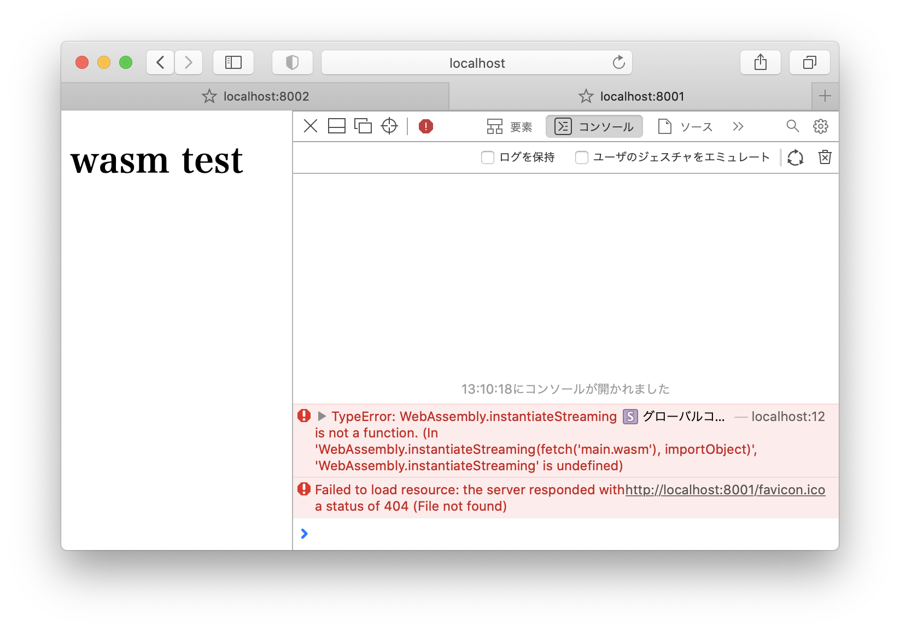

# Simple function export

## Prerequisite
[WebAssembly/wabt: The WebAssembly Binary Toolkit](https://github.com/WebAssembly/wabt) をインストールしていること。

## ソース
`main.wat:`
```wat
(module
  (func $i (import "imports" "imported_func") (param i32))
  (func (export "exported_func")
    i32.const 42
    call $i
  )
)
```
42という数値を返すというシンプルな関数を、wat(WebAssembly テキストフォーマット)形式で記述すると上記のようになる。

## wasmファイルのビルド
```
$ wat2wasm main.wat
```
上記コマンドで、watからwasmに変換することができる。

## 確認方法
```
$ python3 -m http.server 8001
```

ブラウザで`localhost:8001`を開くと、コンソールログに`42`と出力されることが確認できる。

## [補足]学んだこと
safariでは`WebAssembly.instantiateStreaming`というAPIがサポートされておらず、wasmをロードすることができない。


